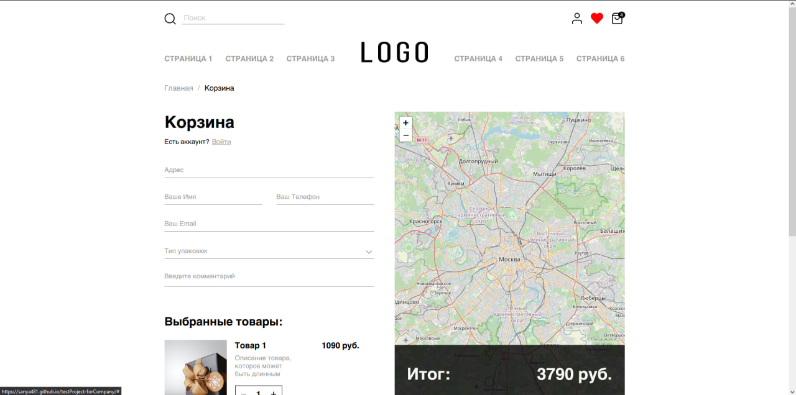

# Тестовое задание на HTML-верстальщика в компанию Пять углов

Необходимо выполнить вёрстку макета в стеке HTML5, BEM, LESS, Jquery.
На выходе ожидаем вёрстку всей страницы..

## [Ссылка на макет](https://www.figma.com/file/1boCdd3xxOKBaOzwt553bj/%D0%A2%D0%B5%D1%81%D1%82%D0%BE%D0%B2%D0%BE%D0%B5-%D0%B7%D0%B0%D0%B4%D0%B0%D0%BD%D0%B8%D0%B5?node-id=0%3A1) :)

Поле “**адрес**” и карта - связаны. На карте должен отображаться маркер с указанным адресом.
Выпадающий список с типом упаковки должен содержать 3 пункта (**выпадающий список обязательно стилизовать**):
1. ”без упаковки”;
2. ”стандартная”;
3. ”подарочная”.

Все поля являются обязательными для заполнения, кроме поля “комментарий”.
При отправке формы должен происходить сбор информации со всех полей в объект FormData. Собранные данные необходимо вывести в console.log().
